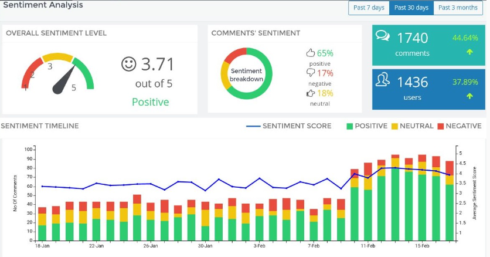

# Real Time Sentiment Analysis Project

This project performs real-time sentiment analysis on streaming data using machine learning techniques. It aims to classify text data into positive, negative, or neutral sentiments. The project integrates Socket for real-time data visualization, News API for retrieving news data, Kafka server for data streaming, and MongoDB for data storage.

## Table of Contents

- [Introduction](#introduction)
- [Installation](#installation)
- [Usage](#usage)
- [Features](#features)

## Introduction

The sentiment analysis project analyzes streaming text data and predicts the sentiment associated with it in real-time. It is designed to handle data from various sources, such as social media or news API, and perform sentiment analysis on the fly. The project uses machine learning algorithms to classify the sentiment of the text data and provides real-time visualization using Socket. It also integrates News API for retrieving news data, Kafka server for data streaming, and MongoDB for data storage.

## Installation

To run this project, follow these steps:

1. Clone the repository: `git clone https://github.com/your-username/sentiment-analysis.git`
2. Install the required dependencies: `pip install -r requirements.txt`
3. Set up Kafka server: Install Kafka and create the necessary topics for data streaming.
4. Set up MongoDB: Install MongoDB and configure the connection settings.
5. Obtain News API key: Sign up for News API and obtain an API key for retrieving news data.
6. Configure the project: Update the configuration files with the required credentials for News API, Kafka server, and MongoDB.

## Usage

1. Prepare the dataset: Ensure you have a dataset containing text data and corresponding sentiment labels.
2. Perform data preprocessing: Clean the text data by removing unnecessary characters, stopwords, or perform other preprocessing steps as required.
3. Feature extraction: Convert the text data into numerical feature vectors using techniques like TF-IDF or word embeddings.
4. Model training: Train a machine learning model using the processed features and sentiment labels.
5. Model evaluation: Evaluate the model's performance using metrics like accuracy, precision, recall, and F1-score.
6. Predict sentiment: Use the trained model to predict the sentiment of new text data.
7. Real-time data visualization: Use Socket to display real-time sentiment analysis results in a web-based dashboard.
8. Retrieve news data: Utilize News API to fetch news articles for sentiment analysis.
9. Data streaming: Use Kafka server to stream data from various sources, such as social media or news API, for real-time sentiment analysis.
10. Store data in MongoDB: Store the streaming data and corresponding sentiment analysis results in MongoDB for further analysis and retrieval.

## Features

- Preprocessing: Clean the text data by removing special characters, stopwords, and perform lemmatization or stemming.
- Feature Extraction: Convert text data into numerical feature vectors using TF-IDF or word embeddings.
- Model Training: Train a machine learning model using algorithms like Logistic Regression, Support Vector Machines, or others.
- Model Evaluation: Evaluate the performance of the model using metrics like accuracy, precision, recall, and F1-score.
- Predict Sentiment: Use the trained model to predict the sentiment of new text data.
- Real-time Data Visualization: Visualize sentiment analysis results in a web-based dashboard using Socket for real-time updates.
- News Data Retrieval: Fetch news articles using News API for sentiment analysis.
- Data Streaming: Utilize Kafka server for streaming data from various sources for real-time sentiment analysis.
- Data Storage: Store the streaming data

